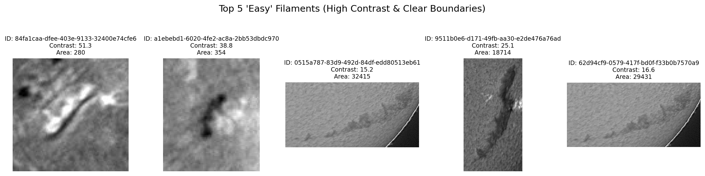
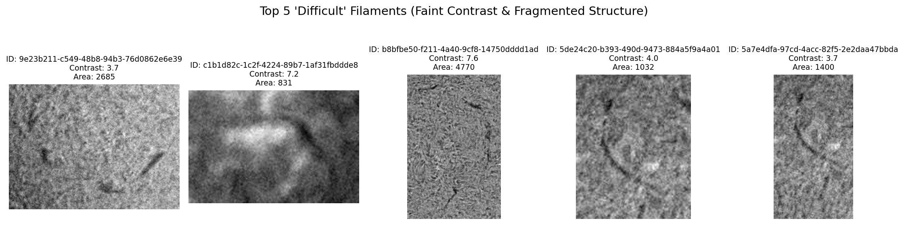
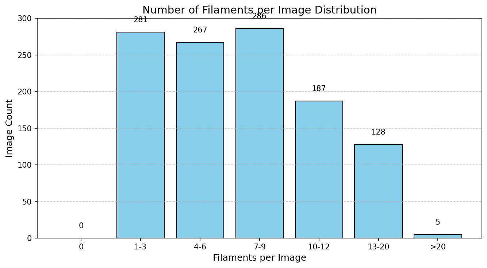
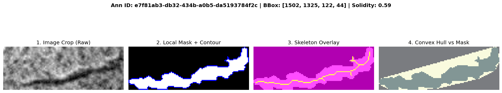
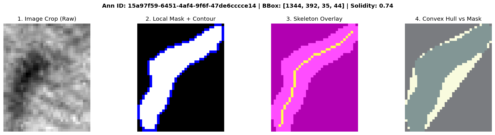
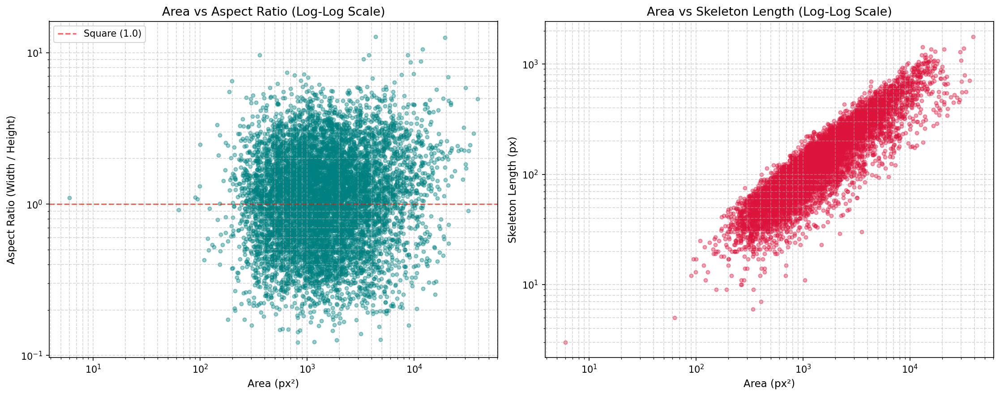
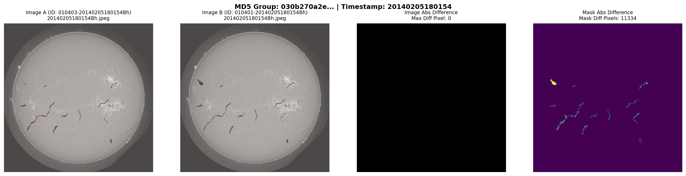
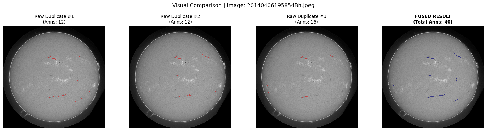

# cv-solar-filament-detection
A machine learning pipeline for solar filament detection, built as part of a Kaggle competition

# Solar Filaments Segmentation Challenge

Solar filaments are dense, relatively cool "clouds" of solar material (plasma) that are suspended above the Sun's surface by powerful magnetic field lines.

1. The Visual Appearance
Even though they are extremely hot, filaments are cooler than the solar surface (photosphere) below them. When viewed through specific wavelengths (like the H-Alpha observations in the MAGFiLO dataset), they absorb the light from below and appear as dark, thread-like streaks or ribbons across the Sun's bright disk. If you view a filament on the edge of the Sun against the blackness of space, it glows bright red—in that position, it is called a solar prominence.

2. The Danger (Space Weather)
Filaments are highly volatile. When the magnetic fields holding them become unstable, they can erupt, violently throwing billions of tons of plasma into space. This is known as a Coronal Mass Ejection (CME). If an Earth-directed CME hits our magnetic field, it can:

 - Overload and destroy electric power grids.
 - Disrupt GPS navigation and satellite communications.
 - Expose astronauts and passengers on high-altitude polar flights to dangerous levels of radiation.
## Overview
This repository contains the source code and machine learning pipeline developed for the Kaggle challenge on [solar filament segmentation](https://www.kaggle.com/competitions/filament-segmentation-2026/overview). 

The objective of this project is to generate highly accurate, pixel-level segmentation masks from H-Alpha solar observations. 

## Dataset: MAGFiLO
The models are trained and evaluated on **MAGFiLO** (Manually Annotated GONG Filaments from H-Alpha Observations). 

**Image Specifications:**
- **Format:** 2048 × 2048 pixels, 8-bit JPEG.
- **Color Space:** Grayscale (not to be processed as RGB).
- **Naming Convention:** Files are named sequentially as `YYYYMMDDHHMMSSII` (e.g., `20260901165702Bh.jpeg` encodes the capture date, time, and the Big Bear observatory code).





Dataset contains 1154 photos with 8199 annotations.The very thin filament samples are only 6 which are less than 5 pixels.

| Percentile | Area (pixels) | Description / Interpretation |
| :--- | :---: | :--- |
| **$P_1$** | 209 px | Lower bound (excluding extreme outliers) |
| **$P_5$** | 317 px | Very small structures |
| **$P_{10}$** | 410 px | Small filament threshold |
| **$P_{25}$** | 670 px | Lower quartile ($Q_1$) |
| **$P_{50}$ (Median)** | 1,228 px | Typical filament size |
| **$P_{75}$** | 2,438 px | Upper quartile ($Q_3$) |
| **$P_{90}$** | 4,685 px | Large structures |
| **$P_{95}$** | 6,947 px | Very large structures |
| **$P_{99}$** | 13,703 px | Upper bound (excluding extreme maximums up to 37,739 px) |

Exploratory Data Analysis (EDA) revealed a wide filament area distribution ranging from 9 to 37,739 pixels, with the upper bound acting as a sparse outlier. This granular scale characterization directly informed my pipeline design:

1. **Receptive Field Selection:** The presence of large structures up to ~37k pixels necessitated architectures capable of capturing broad context, guiding our choice toward dense prediction models with large receptive fields, such as U-Net.
2. **Avoiding Resolution Loss:** Analyzing the size distribution proved critical in preventing suboptimal preprocessing choices. Since native H-Alpha images are 2048×2048 pixels, aggressive downscaling (e.g., resizing to 640×640, commonly used in object detection pipelines) would severely compress small targets—such as $P_1$ instances around 209 pixels—leading to an irreversible loss of fine-scale morphological details (e.g., filament barbs). Preserving high-resolution inputs was therefore essential for accurate segmentation.



| Metric / Interaction Type | Count / Statistics | Percentage / Proportion |
| :--- | :---: | :---: |
| **Total images with $\ge 2$ filaments** | 1,051 | 91.1% |
| **Images with overlapping masks** (Pixel IoU $> 0$) | 7 | 0.6% |
| **Images with touching masks** (1–2 px border boundary) | 8 | 0.7% |
| **Total overlapping instance pairs** | 7 | 7 / 36,064 pairs |
| **Total touching instance pairs** | 9 | 9 / 36,064 pairs |


To evaluate the structural characteristics of solar filaments, I conducted a geometric analysis of individual instances, calculating metrics such as **Solidity** (the ratio of the filament mask area to its convex hull area) and performing **skeletonization** to extract core spines and branching features.





As illustrated in the exploratory analysis:
- **Branching and Barbs:** The skeletonization overlays (Panel 3) clearly capture fine thread-like structures and secondary branches (barbs) extending from the primary spine. These features are critical for solar physics research but pose significant challenges for standard segmentation networks due to their thin profiles.
- **Irregular Geometries:** The low solidity values observed—ranging from **0.59 to 0.74** across samples—confirm that solar filaments are highly non-convex, elongated, and irregular structures rather than solid geometric blobs (Panel 4). This structural complexity demonstrates why standard bounding-box object detection or simple thresholding fails, necessitating robust pixel-level semantic segmentation models.

| Statistic | Area (px) | Aspect Ratio | Perimeter (px) | Solidity | Skeleton Length (px) |
| :--- | :---: | :---: | :---: | :---: | :---: |
| **Count** | 8,199 | 8,199 | 8,199 | 8,199 | 8,199 |
| **Mean** | 2,282.9 | 1.38 | 390.2 | 0.58 | 176.1 |
| **Std** | 2,860.4 | 1.03 | 318.5 | 0.18 | 158.3 |
| **Min** | 6.0 | 0.12 | 6.8 | 0.10 | 3.0 |
| **5%** | 354.0 | 0.33 | 105.6 | 0.28 | 37.0 |
| **25% ($Q_1$)** | 745.5 | 0.66 | 183.3 | 0.45 | 74.0 |
| **50% (Median)** | 1,355.0 | 1.11 | 292.4 | 0.58 | 127.0 |
| **75% ($Q_3$)** | 2,638.0 | 1.79 | 488.1 | 0.71 | 221.0 |
| **95%** | 7,336.7 | 3.34 | 1,026.6 | 0.89 | 487.1 |
| **Max** | 39,145.0 | 12.78 | 3,047.5 | 1.00 | 1,777.0 |



To further investigate dataset characteristics, we performed bivariate log-log scale analyses correlating mask area with aspect ratio and skeleton length (as shown above):

1. **Area vs. Aspect Ratio (Symmetry & Orientation):**
   The scatter plot demonstrates a balanced, roughly symmetric distribution of aspect ratios centered around 1.0 on a logarithmic scale. This indicates an unbiased orientation of solar filaments across the solar disk—meaning filaments are equally likely to extend horizontally or vertically, with no directional artifacts introduced during annotation.

2. **Area vs. Skeleton Length (Strong Linear Correlation):**
   A strict linear correlation is observed between the filament mask area and its corresponding skeleton length in log-log space. This consistent scaling relationship provides a powerful heuristic for **False Positive Mitigation**: any predicted mask whose area-to-skeleton ratio deviates drastically from this empirical distribution can be automatically flagged and filtered out as a morphological anomaly or noise.

3. **Pixel-Level Class Imbalance Evaluation:**
   Analyzing the coverage percentage of filaments per image helps quantify the severe pixel-level class imbalance (where the background vastly dominates over thin filament pixels), guiding our choice of loss functions (e.g., a combination of Dice Loss and Binary Cross-Entropy) to prevent the model from collapsing into predicting all-background masks.







**Annotation Details:**
- **Format:** Ground-truth segmentations are stored as polygons in Run-Length Encoding (RLE) for storage efficiency (lossless conversion to binary masks).
- **COCO Compatibility:** Annotations are structured in a COCO-style format, allowing seamless integration with the `pycocotools` library.
- **Multiple Annotators:** A single H-Alpha observation may contain multiple filaments, and the same image might be evaluated by different annotators independently. These instances are treated as distinct image records in the dataset.(This redundancy introduces overlapping and duplicate annotations into the training set)


**Key Challenges Addressed:**
- **Fine-scale structures:** Capturing thread-like features (barbs) that extend from the main filament body.
- **Background noise:** Distinguishing filament material from imaging artifacts inherent to ground-based observatories.
- **Structural continuity:** Preventing fragmented segmentations and ensuring contiguous physical representations of filament morphology.

## Methodology
> **Note for the reader:** Briefly summarize your specific approach here.

- **Architecture:** Implemented a [insert model name, e.g., U-Net / YOLOv8] tailored for semantic segmentation of fine-scale structures.
- **Preprocessing:** Applied [insert techniques] to suppress background noise and enhance image quality.
- **Post-processing:** Leveraged [insert techniques, e.g., morphological operations] to enforce structural continuity and minimize over-merging.

## Evaluation Metrics
The pipeline is evaluated based on the competition's strict criteria:
- **Panoptic Quality (PQ):** The primary metric measuring both segmentation accuracy and instance recognition.
- **Dice Score & IoU:** Utilized (`torchmetrics.segmentation.DiceScore`) to quantify the exact overlap between predicted and ground-truth masks.
- **Fragmentation Penalties:** The evaluation penalizes one-to-many and many-to-one mapping errors.

## Repository Structure
```text
├── data/                   # Directory for MAGFiLO test/train datasets
├── notebooks/              # Jupyter notebooks illustrating the entire pipeline
├── src/                    # Source code for training and inference
├── requirements.txt        # Utilized packages and their corresponding versions
├── technical_report.pdf    # Detailed 4-page technical report of the methodology
└── README.md
